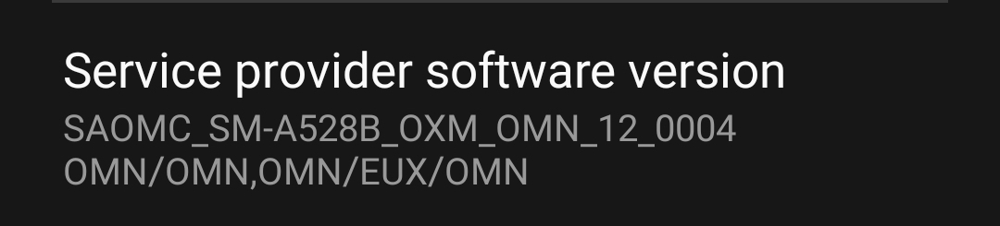

# Modem and bootloader repository
**for Samsung Galaxy A52s 5G**

To [download](https://github.com/BlackMesa123/proprietary_vendor_samsung_a52sxq/releases) the correct binaries for your firmware, please refer to the following table by checking your current OMC sales code (ex. A528B**OXM**1CVE2):

| OMC | CSC |
| --- | --- |
| BRI | BRI |
| ODM | INS |
| OJM | EGY |
| OKR | KOO |
| OLE | XID |
| OLM | XSA |
| OWA | CDR |
| OWM | TGP |
| OWO | PEO |
| OXM | BTU |

Credits to [@jesec](https://github.com/jesec) and [@corsicanu](https://github.com/corsicanu) for the original GitHub Actions script.
